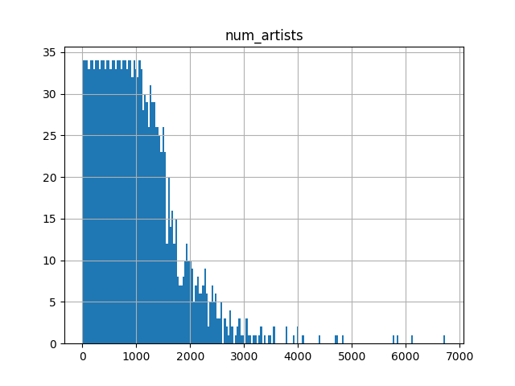

Num artists per user seems uniform to 1000 artists and then tails off...
<>

|    rows|count(DISTINCT user)|count(DISTINCT artist)|max(count)|sum(count)|
|----------|--------------------|----------------------|----------|----------|
|24,296,858|              148,111|               1,568,126|    439,771| 371,638,969|
   